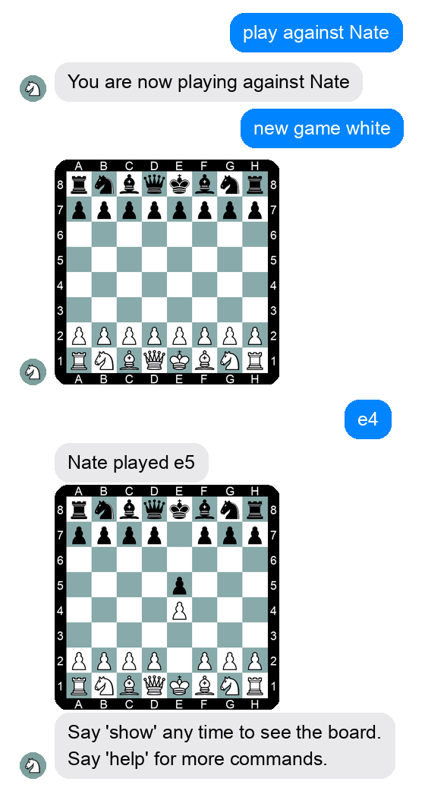

# ♟️ Chessbot

> ⚠️ **This project is retired.** Chessbot ran from 2017 until 2020, when Facebook
> deprecated the Messenger platform APIs it depended on. The code lives on here as a
> showcase. See [The end of the road](#the-end-of-the-road) below.

**Play correspondence chess with your friends — entirely inside Facebook Messenger.**

No app to install, no account to create, no board to set up. You message a Facebook
Page, tell it your name, and start firing off moves in plain algebraic notation. The
bot keeps track of every game, renders the board as an image after each move, and pings
your opponent when it's their turn.

<p align="center">
  
</p>

---

## The idea

Correspondence chess (one move at a time, over days or weeks) is a perfect fit for a
chat app — it's already how you talk to the people you'd want to play against. But every
option at the time meant leaving the conversation: download an app, send an invite, wait
for them to sign up, learn a new UI.

Chessbot collapsed all of that into the chat thread you were already in. Everything is a
message:

```
You    ▸  play against Nate
Bot    ▸  You are now playing against Nate
You    ▸  new game white
Bot    ▸  [board image]
You    ▸  e4
Bot    ▸  Nate played e5
Bot    ▸  [board image]
```

Because both players are humans talking to the same Page, Chessbot could relay moves,
board images, check/checkmate alerts, and even trash talk between the two of you.

## What it could do

Everything is driven by natural-ish text commands:

| Command | What it does |
| --- | --- |
| `my name is <name>` | Register a nickname other players can challenge you by |
| `play against <name>` | Start (or switch to) a game partner |
| `new game white` / `new game black` | Begin a new game, choosing your color |
| `new 960 white` / `new 960 black` | Same, but [Chess960 / Fischer Random](https://en.wikipedia.org/wiki/Fischer_random_chess) |
| `e4`, `Nf3`, `O-O-O`, … | Make a move in standard algebraic notation |
| `show` | Re-send the current board |
| `undo` | Request an undo — or accept your opponent's request |
| `resign` | Resign the current game |
| `ping` | Nudge your opponent that it's their turn |
| `say <message>` | Relay a chat message to your opponent through the bot |
| `explore` | Get a Lichess analysis-board link for the current position |
| `pgn` | Receive the game as a downloadable PGN file |
| `block <name>` / `unblock <name>` | Manage who can play you |
| `reminders on` / `reminders off` | Opt in/out of nudges about idle games |
| `deactivate` / `activate` | Leave or rejoin Chessbot |
| `help` | List the commands |

Nice touches that made it feel finished:

- **Perspective-aware boards.** White players see the board from White's side; Black
  players see it flipped, with rank/file labels to match.
- **Forgiving move parsing.** Case-insensitive input, `0-0`/`o-o` both work for castling,
  and it disambiguates the notorious `b`-pawn-vs-`B`ishop collision.
- **Real chess rules.** Legal-move validation, check/checkmate detection, and end-game
  handling, all backed by [`python-chess`](https://python-chess.readthedocs.io/).
- **Nudges for slow games.** An opt-in reminder job summarized which games had been
  waiting on you and for how long.
- **Multi-game, multi-opponent.** Play several people at once and switch between them by
  name.

## How it worked

```
Facebook Messenger  ──webhook──▶  Flask app (Heroku)  ──▶  PostgreSQL
                    ◀──Send API──                     ──▶  board renderer (Pillow)
```

- **`fbchessbot.py`** — the Flask webhook. Receives Messenger events, routes each message
  through a small decorator-based command dispatcher, and replies via the Facebook Send
  API. Includes message de-duplication (Messenger liked to deliver twice).
- **`dbactions.py` / `dbfuncs.sql`** — persistence in Postgres. Games are stored compactly
  as a start position plus the move stack, so any board is reconstructable and history is
  replayable.
- **`drawing.py` + `sprites/`** — server-side board rendering with Pillow. Piece sprites are
  composited onto a pre-drawn, labeled board and served as a plain image URL that Messenger
  fetches as an attachment. *(The boards in the screenshot above are rendered by this exact
  code.)*
- Deployed on **Heroku** (`Procfile`, `gunicorn`), Python 3.6.

There's also a little `/explore` web UI for spinning up games from arbitrary positions and
a standalone chess **coordinate trainer** page that shipped alongside it.

## The end of the road

Chessbot's entire interface was the Messenger Platform — the webhook that delivered
messages and the Send API that replied with text and board images. In 2020, Facebook
restricted and then removed the messaging permissions that let a Page carry on this kind
of open-ended conversation with users, and there was no path to keep it running.

The [final commit](../../commit/518458a) — aptly titled *"Farewell!"* — replaced the whole
message handler with a single goodbye:

> Chessbot is no longer operational due to a change in the Messenger API.

It had a good run: **~200 commits from June 2017 to April 2020**, and a fun way to play
chess with friends who'd never have installed a chess app.

## Tech stack

Python 3.6 · Flask · Gunicorn · PostgreSQL (psycopg2) · Pillow · python-chess · Facebook
Messenger Platform (webhooks + Send API) · Heroku

## Running it today

You can't, really — the Facebook side is gone. But the code is intact and readable if you
want to see how a Messenger bot was wired up in the pre-Instant-Games era, or lift the
board-rendering and command-dispatch pieces for something new.
